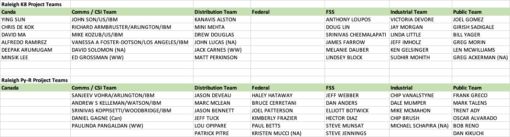

#Team MVP Projects 

##Team Assignments

- **Team Playbacks** 
    - Select a team member to deliver the playback: **10 minutes**
 
 
- Interlock with the Project Owner to understand the project
- At a minimum, complete Chapters 1 through 7 of the PyRK8s Project DOU
    - Introduction
    - Mission Statement
    - Business objectives and Technical Challenges
    - Business Requirements
    - Project Plan
    - Proposed Tests and Critical Success Criteria
    - Project Assumptions
- Choose a presenter and attend the ”PLAYBACK"
- What help we need
   

## **Links to MVP Project Material**

  - [MVP Project Introduction Presentation and Sample DOU document](https://ibm.box.com/v/MVP-Project-Material)

####Team Assignments

  
