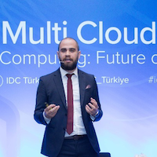

# PYRK8S Bootcamp - Istanbul
IBM 
Levent Mahallesi., Büyükdere Cd. Yapi Kredi Plaza B Blok, 34330 Beşiktaş/İstanbul 
 
[**Map**](https://www.google.com/maps/place/IBM+International+Business+Machines+T%C3%BCrk+Limited+%C5%9Eirketi/@41.0471537,28.8816099,13z/data=!4m8!1m2!2m1!1sibm!3m4!1s0x14cab668924f88e5:0x770319b019a4d0c7!8m2!3d41.080709!4d29.012296)

**Nov 11 - 15 ** 

**Objective for F2F Training**

  - Apply the vendor-agnostic principles from the virtual training to IBM (and Red Hat) Kubernetes solutions.
  
  - Using this knowledge, attendees will create a MVP project and team to execute that project remotely.

**Agenda**

  - The agenda is spread over 5 days onsite.
  
  - During the face to face training teams will discuss and architect an MVP solution which will be executed later.

**Presentations**

[PyRK8's material](https://ibm.box.com/s/vwfpufjcjkvva4q7hlzmktj8472qt7qn)

**Hands on Activities**

This bootcamp contains significant hands on learning. 

From the _navigation menu_, select the **Daily Agenda and Activities** item to view the daily agenda. 

There, you will also find the links to the hands-on **lab guides** and **Skytap environments** that are used for that specific day. 

####Instructors

|  | Name | Title | 
| :--: | :---: | :--- | 
| | [Eswara Kosaraju](https://w3.ibm.com/bluepages/profile.html?uid=3A5245897) | WW Technical Sales | 
| | [Gökhan Yilmaz](https://w3.ibm.com/bluepages/profile.html?uid=011195862) | Hybrid Cloud Technical Sales Specialist | 
| | [Ozan Güzeldereli](https://w3.ibm.com/bluepages/profile.html?uid=ZZ00NR862)| Cloud Integration Architect |

